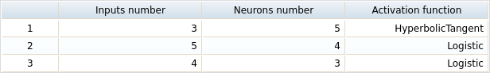

# Увод

Навигацията на мобилни роботи е едно от най-важните както и трудни предизвикателства в областта на мобилната роботика. Трудността се корени в това, че тези роботи трябва да могат да преудоляват препятствия, с които се сблъскват по пътя си към поставена цел. Голяма част от изследователи се съсредоточават върху проучвания относно техники за контрол на роботи и навигация на интелигентни превозни средства, тъй като стандарно използваните техники не могат да се справят с постоянно промещата се среда. Поради тази причина, развитието на интелигентни системи за контрол е толкова необходимо. Като пример - системите базирани на невронни мрежи. Те ни предлагат много решение на проблема с навигация на превозни средства. Огромен плюс е това че те могат да се самообучат и да учат нелинейните връзки между входните параметри, приети от околната средата посредством различни сензори, и изходните стойности, който се предават на превозното средство.

На кратко нашият проблем е следния. Превозното средство се намира в заобикаляща го среда, съдържащата неопределен брой препятствия и цел. Как да достигнем тази цел, без да се сблъскаме с препятствията?

Можем да предложим различни решения на този проблем. От една страна можем да предложим класическо решение - планиране на пътя или граф на видимостта. От друга страна можем да използваме интелигентна система за управление, базирана на Fuzzy Control System ( системи за контрол базирани на размитата логика), който които постоянно приемат входни стойности от околната среда в диапазона от 0 до 1, по което се различават от класическата логиката която приема само стойности Вярно или Невярно (съответно 1 или 0). Тези системи за управление са способни да решат много от проблемите визникващи по време на управление на мобилни роботи. Това се дължи на способността им да имитират някои черти на хората.


## Цел на дипломната работа

Настоящата дипломна работа има за цел разработването на невронна мрежа с право предаване и управление на база три датчика за разстояние, базирана на размита логика.

---

# Глава 1

В тази глава се разглежда теорита свързана с разработката на невронна мрежа за управление, логиката която имплементира. Обърнато е внимание на невронните мрежи в роботиката и размитата логика която стои в основата им. Също така е обърнато внимание на платформата използвана за изграждането на мобилния робот.

## Размита логика

Размитата логика е алтернатива на традиционната логика, при която истината се оценява със стойности от 0.0 до 1.0, където 0.0 представлява абсолютната неистина, а 1.0 е абсолютната истина.

### Същност

Размитата логика е пряко свързана с размитите множества. Създател на теорията на размитите множества е американският учен Лотфи Аскер Заде. През 1965 той публикува първия си труд, посветен на размитите множества. Създадената теория скоро се превръща в обект на сериозен интерес в научните и инжинерните среди, който продължава и до днес.

### Теория

Размитата логика е раздел на математическата логика, занимаващ се с теория на неточно определената информация, която се изразява с приблизителни стойности в интервал ( обикновенно между 0 и 1 ) или с категории ( например, "горещо", "топло", "хладно", "студено". Има редица предимства за представяне и обработка на непълно дефинирани данни. Като типични примери могат да се посочат приложенията в : системи за разпознаване на образи, системи за разпознаване на говор, експертни системи за диагностика в медицината и не на последно място по значимост могат да се посочат приложенията в системите за автоматично управление на различни процеси. В екоинформатиката ( информационните технологии в екологията ? ) съществува проблем с класификацията и обработката на данни с висока степен на неопределеност. Често тези данни са с непрекъснат характер и класическата им класификация е затруднена поради неясните ( размитите ) граници от стойностите им.

Прилагането на методите на размитата логика в тези случаи е удачно. Неточните данни могат да се дефинират като многомерни размити множества с не твърдо дефинирани граници. Това позволява използването на вероятностни модели пр частично липваща информация за изследваните обекти и процеси.

Терминът размита логика води началото си от работата и теорията, развита от Лотфи Заде. През 1965 г. той предлага теорията на размитите множества и по-късно установява размитата логика на базата на тази теория. РЛ вече е намерила добро приложение в много области където е необходимо управление на сложни динамични системи, докато традиционните методи или не дават необходимите резултати или въобще са неприложими. Ето защо изучаването на размитото управление и неговата съпоставка с конвенционалното управление и типовите непрекъснати закони за регулиране са от съществено значение за съвременната теория на управление.

|  | 
|:--:| 
| *Пример за размито множество от стойности, изразяващо понятията "млад", "средно възрастен" и "възрастен" човек* |

В литературата са описани главно три типа структури на размито логическо управление. Основната структура е управление, при което управляващото въздействие u се извежда въз основа на логическата релация между системната грешка e и моментното й изменение Δe. Това управление е от т.н. позиционен тип. Втората структура е размито пропорционално - интегрално (ПИ) управление, която структура е еквивалентна на първата с тази разлика, че изходната величина е моментното изменение на управляващото въздействие Δu, а входните величини са както при размитото пропорционално - производно управление (ПП). Това управление според характера на изходната си величина е от т.н. скоростен тип. Третата структура е на размито пропорционално - интегрално - производно – (ПИП) (proportional integral derivative) управление.

### Приложения

Днес, размитата логика се използва както за целите на автоматизацията така и за:
+ създаването на алгоритми за разпознаване на изображения, образи и звуци
+ обработка на сигнали
+ количествен анализ в икономиката - изследване на финансови операции и други 
+ системи за взимане на решения - експертни системи за диагностика, планиране и предсказване и други
+ обработка на информацията - бази данни 

Използването на размита логика предоставя следните възможности:
+ паралелно изпълнение
+ събиране на доказателства за и против търсеното твърдение
+ работа с неточна информация при високо ниво на прецизност
+ по-малко опитни специалисти могат да създават сложни модели
+ по-малко време за синтезиране на интелигентността на експертите

Размитата логика предоставя механизъм за представяне на неясно и неопределено знание. Тя е близка до начина, по който хората взимат решения поради факта че използва метод за приблизително разсъждение, което позволява работата с неясна и недостатъчна информация. Когато броят на входните променливи се увеличи, броят на правилата се увеличава непропорционално, което може да доведе до усложняване и избор от голям брой правила. Mendel-Wang моделът за обучение на правила използва основно извън работно (off-line) обучение, при което обучаващия цикъл изисква наново стартиране, изискващо първоначално обучение изпълнено едновременно с придобиването на нови данни. Технологии като Mendel-Wang модела притежават недостатък свързан с интерфейса с потребителя, който е базиран на осигуряването на множество то изискващи се стойности вместо взаимодействие със самия потребител и постигане на задоволителен резултат. Основния недостатък на експертните системите и тези базирани на размита логика е голямата зависимост от хора експерти за придобиване на знания. Тези системи са ограничени по отношение на техните приспособимост и възможности за обучение. Мутацията по отношение на размитата логика означава модификация на размитите правила. Размитата логика може да бъде използвана като механизъм за заключения в комплексни дистрибутивни, правила-базирани приложения. Интересен е фактът, че първото промишлено приложение на размитата логика е съвсем скоро след откриването й. През 1975 г., след проведено специализирано изследване, в Дания е пусната в работа циментова пещ с размито управление.

## Невронни мрежи

### Същност

Невронната мрежа е математически модел на система за обработка на информация, организирана по подобие на анатомичното устройство на човешкия мозък. Математическият модел на биологичната невронна мрежа е изграден от множество от взаимносвързани прости изчислителни елементи (неврони). Могат да бъдат посочени следните основни етапи в развитието на невронните мрежи:
+ 1958 г.: създадена е първата изкуствена невронна мрежа, наречена Perceptron
+ 60-те години на ХХ-ти век: създаване на невронни мрежи, чрез които се изучават познавателните способности на човека
+ 80-те години на ХХ-ти век: широко използване на изкуствени невронни мрежи за решаването на разнообразни задачи
+ 1994 г.: начало на масовото производство на невронни компютри. За първи път в Европа тези компютри се произвеждат от Siemens-Nixdorf

Невронът представлява нервна клетка, на която се базира мисловната дейност на човека. Невронът се отличава със следните свойства: уникалност и взаимообвързаност – всеки неврон е свързан със съседите си чрез верига от връзки, които са неповторими в рамките на общата система. Изкуствените невронни мрежи се изграждат по аналогия на естествените невронни мрежи, базирани на микропроцесори (невронни процесори). Невронните мрежи се използват успешно в различни области: техниката, бизнеса, геологията, физиката, медицината и др. С тяхна помощ се решават задачи, свързани с прогнозирането, моделирането и управлението.

Те са привлекателни, защото се основават на биологичния модел на нервните системи. Невронните мрежи имат съществена роля за създаването на изкуствен интелект въз основа на клас алгоритми, чрез които се решават задачи по подобие на човешкия мозък.

Невронните мрежи позволяват автоматично конфигуриране и самообучение чрез постепенно изменение на стойностите на коефициентите за тежест на компонентите на мрежата с цел намаляване на грешката в изходящия от мрежата сигнал. Сигналът за грешка се подава чрез обратна връзка на входа на системата. Чрез невронните мрежи се решават разнообразни проблеми като се използва интуиция. През 1958 г. Франк Розенблат създава първата изкуствена невронна мрежа, която моделира обработката на визуална информация в човешкия мозък. Използването на невронни мрежи се отличава с голяма бързина на процесите, тъй като обработката на информацията се осъществява с помощта на множество компоненти, които работят паралелно.

Могат да бъдат посочени следните предположения за изчисленията, извършвани в мозъка:
+ Невроните интегрират информация.
+ Невроните предават информация за нивото на техния вход.
+ Влиянието на един неврон върху друг зависи от силата на връзката между тях.
+ Научаването става с промяна на силата на връзките между невроните.
+ Обработката на информацията става на етапи.

Всеки неврон приема "сигнали" от предхождащите го в мрежата други неврони под формата на числа, извършва някакви аритметични действия, определени от неговата функция на активация (степен на възбуда) и резултатът се предава по изходящите връзки (синапсите) към следващите неврони. Всяка връзка има тегло, което умножавайки се със сигнала, определя неговата значимост (сила). Теглата на връзките са аналогични на силата на синаптичните импулси, предавани между биологичните неврони. Отрицателна стойност на теглото съответства на подтискащ импулс, а положителна – на възбуждащ.

### Особености

Невронните мрежи се състоят от един, два или повече отделни слоя, които могат да бъдат организирани в различна топология. Математически е доказано, че невронна мрежа с повече от един слой с достатъчно на брой неврони, може да моделира поведението на всяка съществуваща функция. Теглата на връзките между невроните определят функционалността и поведението на невронната мрежа. Съществено предимство на невронните архитектури е възможността те да бъдат обучавани, а в последствие и да се самообучават.

Обучението на една невронна мрежа се постига чрез промяна на теглата на връзките между невроните и се осъществява чрез правила, които определят как да се променят тези тегла. Най-разпространеното сред тях е методът на обратното разпространение на сигнал за грешка (back-propogation), където за всеки изходен неврон се изчислява разликата от желаното му поведение, като се формира сигнал за грешка, който се движи назад към входния слой и по пътя си променя теглата на връзките така, че при следващата активация на мрежата грешката да бъде по-малка от регистрираната.

Двете най-съществени характеристики на невронните мрежи са: способност да се “учат” и способност да генерализират. Невронните мрежи изискват данните да се поддават на обучение. Обучението на системата се реализира чрез промяна в стойностите на тегловните коефициенти. Коефициентите се променят в съответствие с избрания алгоритъм на обучение. Веднъж след като мрежата е “обучена”, тя трябва да се “захрани” с нови данни, които не са били използвани по време на нейното обучение. Това е своеобразен начин на тестване на невронната мрежа, за да се установи дали е в състояние да прогнозира неизвестните изходи или по-точно, способна ли е да генерализира. “Критичен” момент при разработването на една невронна мрежа е определянето броя на скритите слоеве и съдържащите се в тях неврони. В научната литература не съществуват твърдо установени правила и идеална технология за дефиниране оптималния им брой. Най-често прилаганият подход в това направление е на база експерименти (на принципа на опита и грешката).

### Приложения

Невронните мрежи могат да бъдат използвани в различни направления:
+ Изкуствените невронни мрежи се използват успешно за апроксимиране, тъй като чрез тях се „изглаждат” сложни нелинейни зависимости, дори когато като входяща променлива се използва само времевият фактор. Ценното на невронните мрежи е в изграждането на предиктивни модели, като в качеството на независими променливи могат да участват различни метрични и неметрични интервениращи променливи (разходи за промоция и реклама, цени и др.).
+ Използване на рекурентни невронни мрежи (Recurrent neural networks) за отчитане влиянието на рекламната дейност на фирмите, тъй като благодарение на своята архитектура този вид невронни мрежи позволява да се моделират ефекти, които се проявяват с известен лаг във времето.
+ Управление на роботизирани комплекси.
+ Автоматизация на проектирането.
+ Управление на риска при предоставяне на кредити.
+ Предсказване ситуации на фондовия пазар и т.н.
+ Невронни мрежи в областта на телекомуникациите се използват за обработка на сигнали, управление на трафика и маршрутизация, динамично назначаване на канали и др. Класическото приложение на невронните мрежи за обработка на реч намира широко отражение и в телекомуникациите. Речта като естествена комуникация човек-машина е от особено значение за диалога в автономни системи като например: автоматична служба информация; приемане на поръчки по телефона; разпознаване на реч и извеждане на гласови съобщения. Особено актуално става приложението на тези възможности в съвременните Интелигентни мрежи, където много услуги изискват взаимодействие с крайния потребител (въвеждане на допълнителни цифри при номеронабиране, въвеждане на идентификационен код или друга информация, и извеждане на подходящо съобщение) и др.

### Невронните мрежи в роботиката

Интереса към невронните мрежи идва от желанието да се постигне някакво разбиране на основните принципи, който водят до разбиране на базовите функции в човешкия мозък, и как тези тези принципи могат да бъдат използвани при разработката / проектирането на машини който да извършват сложни задачи. В основата си невронните мрежи се справят с познавателни задачи - обучение, адаптация, задачи за генерализация и оптимазация. А именно такива задачи стоят зад проблема с навигацията на мобилни роботи - разпознаване, обучение, взимане на решения и действия. За да се решат тези проблеми се използват размита логика и невронни мрежи.

Те подобряват способността на робота да се учи и адаптира към заобикалящата го среда, в която информацията често е неточна, несигурна или непълна. Обработката на такива данни, който съдържат много шумове най-общо казано, е доста трудна, но невронните мрежи се справят доста ефикасно в сравнение с класическите методи.

Една невронна мрежа представлява масивна система от паралелно разпределени елементи (неврони), които обработват информацията. Тези елементи са свързани в топология от тип граф. Обучението на невронната мрежа може да бъде насочено (Supervised) или ненасочено (Unsupervised). Разликата между двата вида обучение е че насоченото използва определена информация, нормализирана, а ненасоченото използва минимална количество информация която не е нормализирана. ??? . Алгоритмите за ненасоченото обучение предлагат по-ниска сложност на изчисленията, но за сметка на това по ниска точност за разлика от насоченото обучение. 

## Arduino Uno Rev3

Ардуино е проект с отворен код и едноименна компания, произлязла от него, както и свързаното с него потребителско общество. Основната цел е проектиране и производство на електронна платформа с лесен за ползване свободен хардуер и софтуер, позволяващи постигането на интерактивност за неспециалисти. Електронните платки Ардуино могат да бъдат закупени или готови, или като „направи си сам“ комплекти, като схемите им са свободно достъпни за всеки, който би искал да ги сглоби сам. Проектът е основан на семейство платки с микроконтролери, произвеждани главно от SmartProjects, Италия, както и редица други доставчици, които използват различни 8-битови (AVR) микроконтролери или 32-битови (ARM) процесори Atmel. Осигурени са групи от цифрови и аналогови щифтове за вход-изход (I/O), които позволяват свързване с други платки и вериги. Платките включват сериен комуникационен интерфейс, а при някои модели и USB, за зареждане на програми. С оглед програмирането на микроконтролерите Ардуино платформата предоставя интегрирана среда за разработка (IDE), основана на проекта Processing, който поддържа програмните езици C и C++. Първата платка Ардуино е представена през 2005 г. Екипът на проекта иска да предостави на любители, ученици и професионалисти евтин и лесен начин да създават устройства, способни да взаимодействат с околната среда чрез сензори и изпълнителни устройства. Обичайни примери са създаването на прости роботи, термостати и датчици за движение. В средата на 2011 година са произведени приблизително 300 000 комерсиални Ардуино устройства, а през 2013 година броят им нараства до 700 000.

### История

През 2001 г. Кейси Рийс и Бенджамин Фрай стартират проекта Processing, чиято цел е да дадат възможност на непрограмисти да визуалзират графики на екран бързо и лесно. Той вдъхновява други подобни проекти, като един от тях е проектът „Уайринг“ (на английски: Wiring – в буквален превод: електрическа инсталация), насочен към потребители като художници, дизайнери и други хора с различно от техническото образование. Негов автор е колумбийския студент Ернандо Бараган (на испански: Hernando Barragán), който през 2003 г. прилага принципите на Processing, за да създаде платформа за изработване на електронни прототипи, състояща се от програмен език, интегрирана среда за разработка и едноплатков микроконтролер. За разлика от Processing, ориентиран към визуалните изкуства, „Уайринг“ е проектиран да увлича хората към електрониката. Тази платка е предшественик на Ардуино.

Ардуино е свързан с Висшето училище за интерактивен дизайн в Иврея, Италия (Interaction Design Institute Ivrea), в което обучението се фокусира върху човешкото взаимодействие с цифровите продукти и системи и тяхното обратно въздействие върху потребителите. През 2005 г. група студенти създава проект на име „Arduino“, подобен на „Уайринг“. Името идва от бар, наречен на свой ред на маркграф и крал Ардуин от Иврея, където част от основателите обичали да се събират. Други имена на проекта са Margrave of Ivrea и King of Italy.

Ядрото на групата е съставено от Масимо Банци (Massimo Banzi), Дейвид Куартелие (David Cuartielles), Том Иго (Tom Igoe), Джанлука Мартино (Gianluca Martino), Дейвид Мелис (David Mellis).

От 2008 г. обаче в групата настъпва разцепление. Джанлука Мартино регистрира друга компания, регистрира търговска марка Arduino в някои страни и започва продажби на нов сайт arduino.org, докато първоначалната компания контролира продажбите на сайта arduino.cc. Наборът от изделия на двата сайта е различен. Съществуват и две разклонения на Arduino IDE, поддържащи различни платки и библиотеки. Еднаквите названия и номера на версиите на IDE внасят силно объркване.

### Хардуер

Arduino се състои от 8-битов Atmel AVR микроконтролер с допълващи се компоненти, които улесняват програмирането и включването в други вериги. Важен аспект на Arduino платформата е наличието на стандартни конектори, които позволяват на потребителите да свързват CPU платката към голям набор от различни, взаимозаменяеми модули, наречени разширения (шилдове на английски: shields). Някои комуникират с Arduino директно, посредством различни конектори. Благодарение на I2C шина, няколко разширения могат да бъдат прикачени и използвани паралелно.

Повечето Arduino платформи функционират с 5V работно напрежение и разполагат с 14 цифрови входно-изходни порта, 6 аналогови входа, 16 MHz кварцов резонатор (въпреки че някои проекти работят с 8 MHz), четири светодиода, USB конектор, захранващ куплунг, бутон за рестартиране и ICSP конектор. Свързването с компютър става посредством USB кабел USB-A/USB-B.

Микроконтролерът на Arduino е снабден с буутлоудър, който опростява качването на програми във флаш паметта на устройството. Това прави използването на Arduino значително по-просто, като позволява програмиране с помощта на обикновен компютър.

На концептуално ниво, при използване на софтуерния стек на Arduino, всички платки се програмират посредством RS-232 сериен порт, но начинът варира според хардуерните особености на устройството.

На пазара се предлагат различни сменяеми шилдове, които могат да бъдат прикачени към Arduino, някои от които Arduino Nano, Bare Bones Board и Boarduino. Има много Arduino-съвместими и Arduino-производни платки.

### Arduino Uno 

Arduino Uno – микроконтролерна развойна платка с ATmega328P AVR микроконтролер. Има 14 цифрови входно-изходни (I/O) порта, 6 аналогови входа, 16 MHz кварцов резонатор, четири светодиода (един потребителски, свързан на 13-ти цифров I/O порт и три, които индикират работата на платката: ON, Tx и Rx), USB конектор, захранващ куплунг, бутон за рестартиране и ICSP конектор. Шест от цифровите I/O порта могат да се използват като PWM (ШИМ) изходи. Свързването с компютър се осъществява чрез USB кабел USB A – USB B. Uno може да се захранва през USB порта на компютъра или от външен източник, като превключването между различните начини за захранване е автоматично. Външният източник на захранване може да е DC адаптер 7-12V или батерия.

### Софтуер

Интегрираната среда за разработка на „Ардуино“ е мултиплатформено приложение, написано на програмния език Java и произлиза от езика за програмиране „Processing“ и проекта „Wiring“. Конструирана е така, че да улесни програмирането от хора, които не са запознати с писането на софтуер. Съдържа редактор на код с функции като:

+ syntax highlighting (показване на текст в различен цвят в зависимост от принадлежността на термините)
+ brace matching (функция, която следи отварящите и затварящите скоби с цел по–лесна навигация през програмния код),
+ автоматично 

и също така е способен да компилира и да качва програми към устройството с един клик.

Програма, написана за Ардуино, се нарича „скеч“ и е написана на програмните езици C и C++. Средата за разработка „Ардуино“ идва със софтуерна библиотека „Wiring“ (името идва от оригиналния „Wiring“ проект), което улеснява много входни/изходни операции.

За да направят циклично изпълняваща се програма, потребителите трябва да дефинират само две функции,:

+ `Setup()` : Функция, която се изпълнява веднъж в началото на програмата и може да инициализира настройки;
+ `Loop()` : Функция, която не спира да се извиква докато Ардуино не се изключи.
Типична първа програма за микроконтролер е просто примигваща LED светлинка. В средата за разработка на Ардуино потребителят може да напише програма като:

```c
#define LED_PIN 13

void setup() {
    pinMode(LED_PIN, OUTPUT);       // Enable pin 13 for digital output
}

void loop() {
    digitalWrite(LED_PIN, HIGH);    // Turn on the LED
    delay(1000);                    // Wait one second (1000 milliseconds)
    digitalWrite(LED_PIN, LOW);     // Turn off the LED
    delay(1000);                    // Wait one second
}
```


---

# Глава 2

В таза глава се разглежда процеса на проектиране на невронна мрежа, както и свързаните с нея компоненти.

## Хардуерна изисквания

### Устройство на мобилния робот

Дизайнът на мобилния робот е направен, за да бъде лесно модифицирани и приспособими към нови и бъдещи изследвания. Физическият външен вид на робота беше оценен, и дизайнът е определен въз основа на критериите за функционалност, налични материали и мобилност.

Робота е базиран на платформата Arduino и ShieldBot.

|  |
|:--:|
| *Фиг.2.1* |

Компонентите на робота са следните ( от Фигура 1 ):
1. Колела
2. Ел. мотори
3. Сензори за дистанция - модел *MB1010 LV-MaxSonar-EZ1*
4. Платформа ShieldBot
5. Сферично колело
6. Arduino Uno
7. Батерия

Допълнителна информация за по-важните компоненти.

#### 1. Сензори за дистанция - модел *MB1010 LV-MaxSonar-EZ1*

|  |
|:--:|
| *Фиг.2.2 - MB1010 LV-MaxSonar-EZ1* |

С помоща на тези сензори ще измерваме дистанцията до препятствията, който ще трябва нашия робот да заобиколи. Ето някои от спецификациите на тези сензори.

+ Разделителна способност от 1 инч
+ 20Hz скорост на четене
+ 42kHz Ултразвуков датчик измерва разстоянието до обекти
+ RoHS съвместим
+ Възможност за четене от всички 3 сензорни изхода: Аналогов напрежение, RS232 сериен, Широчина на импулса
+ Максимален диапазон от 254 инча (645 см)
+ Работи от 2,5-5,5V
+ 2.0 mA среднa сила на тока
+ Малък, лек модул
+ Най-широк лъч на сензорите LV-MaxSonar-EZ
+ Най-популярният вътрешен ултразвуков далекомер
+ Най-добър баланс на лъча и чувствителността за сензорите LV-MaxSonar-EZ

#### 2. Платформа ShieldBot

|  |
|:--:|
| *Фиг.2.3* |

|  |
|:--:|
| *Фиг.2.4* |

Тази платформа представлява най-голяма част от нашия робот. В нея са интегрирани задвижващите механизми - ел. мотори и колела. Също така притежава сферично колело в предната си част за да осигури възможно най-голяма мобилност на робота.


+ Сензор 5x IR отражателни датчици за линия и ръб след
+ Литиево-йонна акумулаторна батерия 900 mAh
+ Предавателен мотор Две устойчиви 160:1 микрометални предавателни мотори
+ Grove Port 6x Grove разширителни портове
+ Шифрован хедър - Ардуино Шийлд разширителни глави

#### 3. Arduino Uno

|  |
|:--:|
| *Фиг.2.5 - Arduino Uno* |

Платформата Ардуино Уно ще играе ролята на "мозък" за нашия робот. Върху нея ще бъде имплементира под формата на алгоритъм системата за взимане на решения, базирана на създадената невронна мрежа. Тази платформа има следните характеристики

+ Микроконтролер - ATmega328P 
+ Работно напрежение - 5V
+ Препоръчително входно напрежение - 7-12V
+ Максимално входно напрежение - 12-20V
+ Цифрови входно-изходни пинове - 14
+ Входни Аналогови пинове - 6
+ Flash Memory    32 KB (ATmega328P)
+ SRAM    2 KB (ATmega328P)
+ EEPROM    1 KB (ATmega328P)
+ Clock Speed    16 MHz
+ LED_BUILTIN    13
+ Дължина - 68.6 mm 
+ Ширина - 53.4 mm
+ Тегло - 25 g

## Софтуерна изисквания

### Дизайн на невронната мрежа за взимане на решения

Основната трудност е да се намери път, който да позволи на мобилния робот да премине препятствията без да се сблъсква с тях. За такива ситуации можем да използваме най-различни видове невронни мрежи - персептрон, многослоен персептрон, мрежа с обратно разпространение на грешката, вероятностна невронна мрежа и други.

Невронната мрежа избрана да реши проблема е многослоен персептрон, защото тази мрежи имат най-добрите характеристики да решат проблеми като нашия (класификация). Също така може да добавим факта, че имат стравнително лесна архитектура за имплементация.

|  |
|:--:|
| *Фиг.2.6 - Структура на невронната мрежа с 3 входа и 3 изхода* |

Както е показано на Фиг.2.6, нашата невронна мрежа има три неврона във входния слой. Това се дължи на входните ни данни, а именно отчетените стойности от трите сензора за дистанция. Също така имаме 2 скрити слоя.

Първият скрит слой е с пет неврона, чиято активираща функция е хиперболична (hyperbolic tangent-tanh). 

Вторият скрит слой съдържа четири неврона. Тяхната активираща функция е логистична. Логистичните функции често се използват в невронните мрежи за въвеждане на нелинейност в модел и / или за стягащи сигнали в рамките на определен диапазон. Популярния невроннен мрежов елемент изчислява една линейна комбинация от неговите входни сигнали и прилага ограничена логистична функция на резултата. Този модел може да се разглежда като "загладен" вариант на класическия невронов праг.

Изходния ни слой съдържа три невронна - нашите предефинирани команди който ще изпращаме към робота - Завой на ляво, продължи напред и завой на дясно. Тяхната активираща функция е също логистична.

Имайки предвид входните данни от трите датчика, невронната мрежа ще изведе вектор с три стойности. Всяка от тях отговаря на дефинирана от нас посока в която трябва да се насочи робота. Тези стойности ще бъдат в диапазона [0,1], като ще се изпълнява тази която е най-близко до единица.

### Разработка на мрежата

Тъй като сме ограничени от възможностите на платформата за разработка( не достатъчно памет и изчислителна мощ ), невронната мрежа трябва да бъде разработена, обучена и оптимизирана offline.
Така вече създадената мрежа, може да бъде написана на C++ за да компилирана и стартирана върху платформата за разработка.

---

# Глава 3

### Използвани продукти

+ #### Neural Designer

Neural Designer е приложение за извличане на данни, предназначено за професионални изследователи на данни.

Той използва невронни мрежи, които са математически модели на мозъчната функция, които могат да бъдат обучени, за да изпълняват задачи като функционална регресия, разпознаване на шаблони, прогнозиране на времеви серии или автоасоциация.

Софтуерът осигурява графичен потребителски интерфейс. Той ви позволява да изпълнявате задачите и да получавате изчерпателни резултати като отчет по лесен начин.

Neural Designer е напредничав по отношение на ефективността. Всъщност той е разработен с използване на C ++, е бил подложен на техники за оптимизиране на кода и използва паралелна обработка. Той може да анализира по-големи данни в по-кратко време.

+ #### Arduino IDE

Интегрирана среда за разработка, предоставена от създателите на Arduino. 

IDE на Arduino поддържа езиците C и C ++, като използва специални правила за структуриране на кода. Ардуино IDE доставя софтуерна библиотека от проекта "Wiring", която осигурява много общи процедури за въвеждане и извеждане. Написаният от потребителя код изисква само две основни функции за стартиране на скицата и главната програмна линия, които се компилират и свързват с функицията main(),, като получения резултат е циклична изпълнителна програма с GNU toolchain, която също е включена в IDE дистрибуцията. Arduino IDE използва програмата avrdude за преобразуване на изпълнимия код в текстов файл в шестнадесетично кодиране, който се зарежда в борда на Arduino чрез програма за зареждане на фърмуера на борда.

+ #### Python

Python е интерпретиран програмен език на високо ниво за програмиране с общо предназначение. Създаден от Гуида ван Россум и първо пуснат през 1991 г., Python има философия на дизайна, която набляга на четливостта на кода и синтаксис, който позволява на програмистите да изразяват понятия в по-малко кодови редове, като използват значещи празени интервал. Тя осигурява конструкции, които позволяват ясно програмиране както в малки, така и в големи размери.

Python разполага с динамични типове на данните и автоматично управление на паметта. Той поддържа множество парадигми за програмиране, включително обектно-ориентирано, императивно, функционално и процедурно, и разполага с широка и изчерпателна стандартна библиотека.

### Входни данни

Тъй като нашата мрежа ще бъде разработена и обучена извън устройството, върху което ще работи, трябва да започнем със създаването на примерни данни. Тези данни ще използваме за генерирането на модела на невронната мрежа.

Нащите данни трябва да изглеждат по следния начин.

| leftSensor | middleSensor | rightSensor | left | forward | right |
|------------|--------------|-------------|------|---------|-------|
| 60         | 35           | 70          | 0    | 1       | 0     |
| 70         | 31           | 24          | 1    | 0       | 0     |
| 27         | 19           | 65          | 0    | 0       | 1     |

Данните на в първите три колони ще играят отчетените стойности от нашите сензори за дистанция. Мерната единица е сантиметри. Тъй като искаме нашия робот да заобикаля препятствията ние искаме когато отчетените стойности са под някакъв минимален праг, робота да реагира и смени посоката си на движение. Нека тази стойност бъде 25 см. 

Следващото усложие което трябва да изпълнява робота е да се насочва в посоката която му предоставя най-голямо разстояние за движение преди нова промяна на посоката. Ако разгледаме втория ред от примерните данни, ще забележим че посоката на движение, която бихме желали да получим е НА ЛЯВО, въпреки че робота има 6 см в посока НАПРЕД, преди да се наложи да промени посоката.

Но за жалост тези три кортежа от данни не са достатъчни за доброто обучение на невронна мрежа. За да генерираме повече обучителни данни ще използваме програма написана на Python, която има следния код.

```python
from random import randint
import scipy
import csv

def main():
    with open('./trainingData.csv', 'w') as csvfile:
        writer = csv.writer(csvfile)
        writer.writerow(['leftSensor', 'middleSensor', 'rightSensor', 'left', 'forward', 'right'])
        lines = []
        for i in range(number):
            row = []
            for j in range(3):
                row.append(randint(15, 100))

            if row[1] < 25:
                if row[0] >= row[2]:
                    row.append(1)
                    row.append(0)
                    row.append(0)
                elif row[0] < row[2]:
                    row.append(0)
                    row.append(0)
                    row.append(1)
            elif row[0] < 25:
                row.append(0)
                row.append(0)
                row.append(1)
            elif row[2] < 25:
                row.append(1)
                row.append(0)
                row.append(0)
            else:
                row.append(0)
                row.append(1)
                row.append(0)

            lines.append(row)

        for line in lines:
            writer.writerow(line)


    return 0

if __name__ == '__main__':
    if sys.argv[1]:
        number = sys.argv[1]
    else:
        number = 150 
    main()

```

След изпълнение на програмата, в резултатния файл `trainingData.csv` имаме 150 кортежа с произволни данни, който ще послужат за създаването на невронната мрежа и нейното обучение.

### Невронна мрежа

Вече свободно можем да преминем към създаването на невронната мрежа в `Neural Designer`.

+ #### Създаваме нов проект за класификация

|  |
|:--:|
| *Фиг.3.1* |


+ #### Зареждане на обучителните данни

|  |
|:--:|
| *Фиг.3.2* |

|  |
|:--:|
| *Фиг.3.3* |

+ #### Конфигурация на невронната мрежа

|  |
|:--:|
| *Фиг.3.4* |

|  |
|:--:|
| *Фиг.3.5* |

+ #### Метод на обучение

|  |
|:--:|
| *Фиг.3.6* |

+ #### Финален изглед на невронната мрежа

|  |
|:--:|
| *Фиг.3.7* |

`Neural Designer` ни извежда обща информация за генерираната от нас мрежа:

  1. Input
  |  |
  |:--:|
  | *Фиг.3.8* |

  2. Scaling layer
  |  |
  |:--:|
  | *Фиг.3.9* |

  3. Neural Network
  |  |
  |:--:|
  | *Фиг.3.10* |

  4. Output
  |  |
  |:--:|
  | *Фиг.3.11* |

  5. Neural network graph
  |  |
  |:--:|
  | *Фиг.3.12* |


### Обучение
### Оптимизация
### Реализация на невронната мрежа на C++

# Заключение

# Литература

# Приложение 